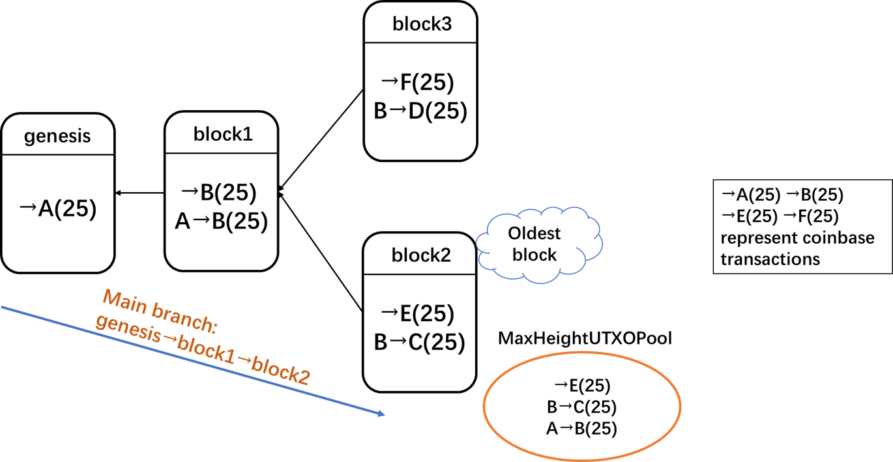
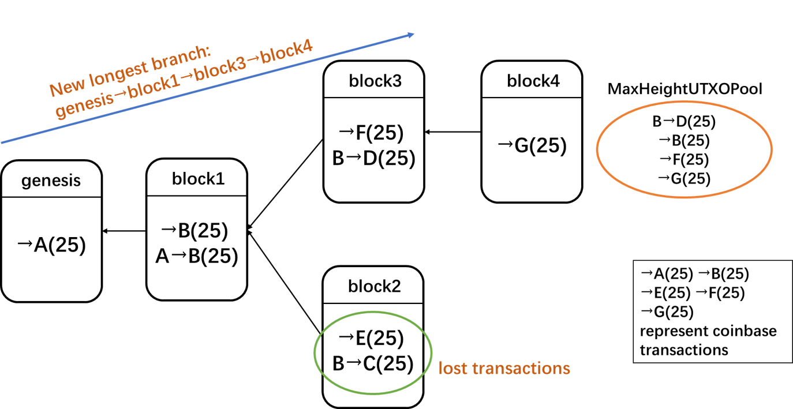
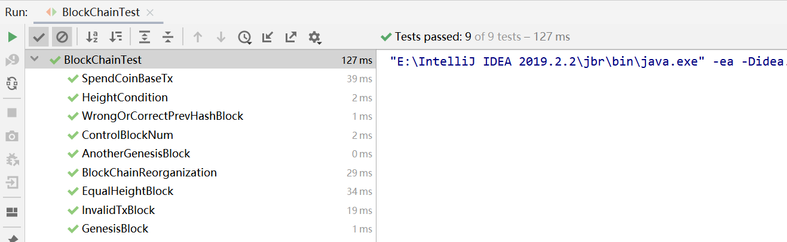

# Homework 2 : Block Chain
**Name**: He Junxian  

**ID**:1901212583

**Note**: source codes are under the path **src/main/java** and codes of test cases are under **src/test/java**

## Summary
In this homework, we are required to implement a node that’s part of a block-chain-based distributed 
consensus protocol. Specifically, the mechanism we design can receive incoming transactions and blocks and maintain 
an updated block chain.

## BlockChainNode class
As required, we need to maintain a UXTO Pool as well as a height value corresponding to every block. The provided **_Block_**
class is not enough for doing so, so we wrap the **_Block_** class into a new class called **_BlockChainNode_**.
```java
public class BlockChainNode {

    private Block block;
    private int height;
    private UTXOPool utxoPool;

    public BlockChainNode(Block block, UTXOPool utxoPool, int height) {
        this.block = block;
        this.utxoPool = utxoPool;
        this.height = height;
    }
    public Block getBlock() {
        return block;
    }
    public int getHeight() { return height; }
    public UTXOPool getUtxoPool() { return utxoPool; }
}
```
## Implementation of BlockChain class
Our **_BlockChain_** class consists of: 
* constructor **_BlockChain(Block genesisBlock)_**, which creates a new block chain with just a genesis block,
* **_getMaxHeightBlock()_**, which returns the highest block, i.e. the latest block of the longest branch,
* **_getMaxHeightUTXOPool()_**, which returns the **_UTXOPool_** of the highest block, on top of which a new block will be mined,
* **_getTransactionPool()_**, which returns the global transaction pool of the block chain,
* **_addBlock(Block block)_**, which adds a block to the block chain if it satisfies following 2 conditions:
  * the height of the block is greater than **_MaxHeight-CUT_OFF_AGE_**, 
  * all transactions included in the block are valid.  
* **_addTransaction(Transaction tx)_**, which adds a new transaction to the global transaction pool.

**_addBlock(Block block)_** is the key method of **_BlockChain_** class, therefore we present the code here along with detailed
annotations. It can be noted that we set a limit to the number of blocks in the chain in order to prevent memory overflow.
If the height of **_MaxHeightBlock_** is greater than the preset value **_MaxNum_**, blocks with height less than or equal to
**_MaxHeight-MaxNum_** will be removed from the chain. 
```java
public boolean addBlock(Block block) {
        // a valid block that can be added to the block chain should satisfy following conditions:

        /** 
         * condition(1): it should have a valid parent, i.e. not a genesis block, because a new genesis
         * block won't be mined.
         */
        boolean c1 = (NodeChain.containsKey(block.getPrevBlockHash())) && (block.getPrevBlockHash() != null);
        if (!c1) {
            return false;
        }

        /** 
         * condition(2): the block itself should have a valid hash value
         */
        boolean c2 = (block.getHash() != null);
        if (!c2) {
            return false;
        }

        /** 
         * condition(3): all transactions in the block should be valid transactions
         */
        BlockChainNode parentNode = NodeChain.get(block.getPrevBlockHash());
        TxHandler txHandler = new TxHandler(parentNode.getUtxoPool());
        List<Transaction> validTransactions = txHandler.handleTxs(block.getTransactions());
        boolean c3 = (validTransactions.size() == block.getTransactions().size());
        if (!c3) {
            return false;
        }

        /** 
         * condition(4): the height condition should be satisfied
         */
        boolean c4 = (parentNode.getHeight() + 1 > MaxHeightNode.getHeight() - CUT_OFF_AGE);
        if (!c4) {
            return false;
        }

        // if all 4 conditions are satisfied, the block can be added to the chain

        if (c1 && c2 && c3 && c4) {

            // create a new BlockChainNode
            txHandler.handleTxs(block.getTransactions());
            BlockChainNode node =
                    new BlockChainNode(block, addcoinbaseTxtoUTXOPool(txHandler.getUTXOPool(), block), parentNode.getHeight() + 1);
            // put the newly created node onto NodeChain
            NodeChain.put(block.getHash(), node);
            // update the MaxHeightMode
            if (MaxHeightNode.getHeight() < node.getHeight()) {
                MaxHeightNode = node;
            }
            // remove transactions of the newly added block from  transactionPool
            List<Transaction> txs = block.getTransactions();
            for (Transaction tx : txs) {
                transactionPool.removeTransaction(tx.getHash());
            }
            //control the number of blocks
            if (MaxHeightNode.getHeight() > MaxNum) {
                Iterator iter = NodeChain.entrySet().iterator();
                while (iter.hasNext()) {
                    Map.Entry entry = (Map.Entry) iter.next();
                    Object key = entry.getKey();
                    Object val = entry.getValue();
                    if(((BlockChainNode)val).getHeight() <= MaxHeightNode.getHeight() - MaxNum)
                        iter.remove();
                }
                }
                return true;
            }
            return false;
        }
```

**All related codes of **_BlockChain_** class along with detailed annotations are in _BlockChain.java_ file.**


## Design of test suite
After we implement the **_BlockChain_** class, we need to verify if the chain we design works properly.
Here we use JUnit to design and execute the test suite. 
In this part, we will illustrate all 9 test functions one by one, including the function's purpose and 
the details of test cases we design.

### Test1: **GenesisBlock()**
#### **Purpose**
**_GenesisBlock()_** is to test whether we can create a new block chain with a genesis block.

#### **Test Case and Analysis**
* A mined the genesis block, so the coinbase transaction goes to A.
* Then we create a new block chain with the genesis block, so the highest block of the chain should be the genesis block
and the _MaxHeightUXTOPool_ should include only 1 transaction: the coinbase transaction of genesis block.

#### **Code**
```java
    public void GenesisBlock() throws Exception {
        // A mined the genesis block, the coinbase transaction goes to A
        Block genesisBlock = new Block(null, pairA.getPublic());
        genesisBlock.finalize();
        // create a new block chain with the genesis block
        BlockChain blockChain = new BlockChain(genesisBlock);
        BlockHandler blockHandler = new BlockHandler(blockChain);

        Block maxHeightBlock = blockChain.getMaxHeightBlock();
        Transaction coinBaseTx = new Transaction(25, pairA.getPublic());

        // the highest block of the chain should be the genesis block
        assertThat(maxHeightBlock.getHash(), equalTo(genesisBlock.getHash()));
        assertThat(maxHeightBlock.getCoinbase(), equalTo(coinBaseTx));

        // the MaxHeightUXTOPool should include only 1 transaction: the coinbase transaction of genesis block
        assertThat(blockChain.getMaxHeightUTXOPool().getAllUTXO().size(), equalTo(1));
        assertThat(blockChain.getMaxHeightUTXOPool().getAllUTXO().get(0), equalTo(new UTXO(coinBaseTx.getHash(), 0)));
    }
```

### Test2: AnotherGenesisBlock()
#### **Purpose**
**_AnotherGenesisBlock()_** is to test whether we can prevent another genesis block from being added to
the chain. Because a new genesis block won't be mined, another genesis block should not be added to the chain.

#### **Test Case and Analysis**
* A mined the genesis block, so the coinbase transaction goes to A. We create a new block chain with the genesis block.
* B mined another genesis block.
* B's genesis block should not be added to the existing block chain.

#### **Code**
```java
public void AnotherGenesisBlock() throws Exception {
        // A mined the genesis block, the coinbase transaction goes to A
        Block genesisBlock = new Block(null, pairA.getPublic());
        genesisBlock.finalize();
        // create a new block chain with the genesis block
        BlockChain blockChain = new BlockChain(genesisBlock);
        BlockHandler blockHandler = new BlockHandler(blockChain);

       // B mined another genesis block, the coinbase transaction goes to B
        Block anothergenesisBlock = new Block(null, pairB.getPublic());
        anothergenesisBlock.finalize();

        //  another genesis block should not be added to the chain
        assertThat(blockHandler.processBlock(anothergenesisBlock), equalTo(false));
    }
```

### Test3: WrongOrCorrectPrevHashBlock()
#### **Purpose**
**_WrongOrCorrectPrevHashBlock()_** is to test whether we can prevent a new block with a wrong 
_prevHash_ from being added to the chain.

#### **Test Case and Analysis**
* A mined the genesis block, so the coinbase transaction goes to A. We create a new block chain with the genesis block.
* B mined the next block, but the _prevHash_ of B's block is different from the hash
of genesis block, so B's block should not be added to the chain due to wrong _prevHash_.
* Only when the _prevHash_ of B's block is the hash of genesis block, B's block can be added to the chain.

#### **Code**
```java
   /**
     * For simplicity, the new block here doesn't include any transaction.
     * More complicated cases will be tested later.
     */
    public void WrongOrCorrectPrevHashBlock() throws Exception {
        // A mined the genesis block, the coinbase transaction goes to A
        Block genesisBlock = new Block(null, pairA.getPublic());
        genesisBlock.finalize();
        // create a new block chain with the genesis block
        BlockChain blockChain = new BlockChain(genesisBlock);
        BlockHandler blockHandler = new BlockHandler(blockChain);

        byte[] correctprevHash=blockHandler.getBlockChain().getMaxHeightBlock().getHash();

        // B mined the next block, the coinbase transaction goes to B
        // if there is something wrong with the prevHash
        byte[] wrongprevHash= Arrays.copyOf(correctprevHash,correctprevHash.length);
        wrongprevHash[0]++;
        Block wrongprevHashBlock = new Block(wrongprevHash, pairB.getPublic());
        wrongprevHashBlock.finalize();

        // block with a wrong prevHash should not be added to the chain
        assertThat(blockHandler.processBlock(wrongprevHashBlock), equalTo(false));

        // B mined the next block, the coinbase transaction goes to B
        // this time the prevHash is correct
        Block correntprevHashBlock = new Block(correctprevHash, pairB.getPublic());
        correntprevHashBlock.finalize();

        // block with a correct prevHash should be added to the chain
        assertThat(blockHandler.processBlock(correntprevHashBlock), equalTo(true));
    }
```

### Test4: SpendCoinBaseTx()
#### **Purpose**
**_SpendCoinBaseTx()_** is to test whether we can spend the coinbase transaction in the next block mined on top of the 
genesis block.

#### **Test Case and Analysis**
* A mined the genesis block, so the coinbase transaction of genesis block goes to A. We create a new block chain with the genesis block.
* A then transfers 25 coins to B, claiming its coinbase transaction as input. **(Tx A_to_B)**
* B mined the next block(block1), so the coinbase transaction of block1 goes to B, and **Tx A_to_B** is included in block1.
* block1 is then added on top of the genesis block(the current highest block).
* After block1 is added to the chain, **Tx A_to_B** is removed from _TransactionPool_, so _TransactionPool_
 should have 0 transaction.
* After block1 is added to the chain, _MaxHeightUTXOPool_ should include 2 UXTOs: **coinbase transaction of block1** and 
**Tx A_to_B**

#### **Code**
```java
public void SpendCoinBaseTx() throws Exception {
        // A mined the genesis block, the coinbase transaction goes to A
        Block genesisBlock = new Block(null, pairA.getPublic());
        genesisBlock.finalize();
        // create a new block chain with the genesis block
        BlockChain blockChain = new BlockChain(genesisBlock);
        BlockHandler blockHandler = new BlockHandler(blockChain);

        // A transfers 25 coins to B, claiming its coinbase transaction as input
        Transaction A_to_B = new Transaction();
        A_to_B.addInput(genesisBlock.getCoinbase().getHash(), 0);
        A_to_B.addOutput(25, pairB.getPublic());
        A_to_B.signTx(pairA.getPrivate(),0);
        A_to_B.finalize();

        // add the above transaction into transactionPool
        blockHandler.getBlockChain().addTransaction(A_to_B);

        /**
         * assume B mined the next block(block1), the coinbase transaction goes to B
         * transaction A_to_B is included in this block
         * block1 is added on top of the genesis block(the current highest block)
         */
        Block block1=new Block(blockHandler.getBlockChain().getMaxHeightBlock().getHash(),pairB.getPublic());
        block1.addTransaction(A_to_B);
        block1.finalize();
        assertThat(blockHandler.processBlock(block1), equalTo(true));

        /**
         * After block1 is added to the chain, transaction A_to_B should be removed from TransactionPool
         * TransactionPool should have 0 transaction
         */
        assertThat(blockHandler.getBlockChain().getTransactionPool().getTransactions().size(),
                equalTo(0));

        /**
         * After block1 is added to the chain, MaxHeightUTXOPool should include 2 UXTOs:
         * coinbase transaction of block1 and transaction A_to_B
         */
        assertThat(blockHandler.getBlockChain().getMaxHeightUTXOPool().getAllUTXO().size(),
                equalTo(2));
        assertThat(blockHandler.getBlockChain().getMaxHeightUTXOPool().contains(new UTXO(A_to_B.getHash(),0)),
                equalTo(true));
        Transaction coinBaseTx = new Transaction(25, pairB.getPublic());
        assertThat(blockHandler.getBlockChain().getMaxHeightUTXOPool().contains(new UTXO(coinBaseTx.getHash(),0)),
                equalTo(true));

    }
```

### Test5: InvalidTxBlock()
#### **Purpose**
**_InvalidTxBlock()_** to test whether we can prevent a new block with invalid transactions from being added to the chain.
Since in Homework1 we have already tested various kinds of invalid transactions, here for simplicity we only consider double spending.

#### **Test Case and Analysis**
* A mined the genesis block, so the coinbase transaction of genesis block goes to A. We create a new block chain with the genesis block.
* A then transfers 25 coins to B, claiming its coinbase transaction as input. **(Tx A_to_B)**
* A again transfers 25 coins to C, claiming its coinbase transaction as input. **(Tx A_to_C)**
* **Tx A_to_B** and **A_to_C** cause double spending problem.
* D mined the next block(block1), the coinbase transaction of block1 goes to D.
* **Tx A_to_B** and **A_to_C** are included in block1. Since the two transactions are double spending, they are invalid, 
thus block1 should not be added to the chain.
* Because block1 can not be added to the chain, **Tx A_to_B** and **A_to_C** still remain in _TransactionPool_. 
The number of transactions in _TransactionPool_ should be 2.

#### **Code**
```java
public void InvalidTxBlock() throws Exception {
        // A mined the genesis block, the coinbase transaction goes to A
        Block genesisBlock = new Block(null, pairA.getPublic());
        genesisBlock.finalize();
        // create a new block chain with the genesis block
        BlockChain blockChain = new BlockChain(genesisBlock);
        BlockHandler blockHandler = new BlockHandler(blockChain);

        // A transfers 25 coins to B, claiming its coinbase transaction as input
        Transaction A_to_B = new Transaction();
        A_to_B.addInput(genesisBlock.getCoinbase().getHash(), 0);
        A_to_B.addOutput(25, pairB.getPublic());
        A_to_B.signTx(pairA.getPrivate(),0);
        A_to_B.finalize();
        // add transaction A_to_B into transactionPool
        blockHandler.getBlockChain().addTransaction(A_to_B);

        // A again transfers 25 coins to C, claiming its coinbase transaction as input,
        // which causes double spending problem.
        Transaction A_to_C = new Transaction();
        A_to_C.addInput(genesisBlock.getCoinbase().getHash(), 0);
        A_to_C.addOutput(25, pairC.getPublic());
        A_to_C.signTx(pairA.getPrivate(),0);
        A_to_C.finalize();
        // add transaction A_to_C into transactionPool
        blockHandler.getBlockChain().addTransaction(A_to_C);

        /**
         * Assume D mined the next block(block1), the coinbase transaction goes to D
         * transaction A_to_B and A_to_C are included in this block
         * Since the two transactions are double spending, they are invalid, thus block1 should not be
         * added to the chain
         */
        Block block1=new Block(blockHandler.getBlockChain().getMaxHeightBlock().getHash(),pairD.getPublic());
        block1.addTransaction(A_to_B);
        block1.addTransaction(A_to_C);
        block1.finalize();
        assertThat(blockHandler.processBlock(block1), equalTo(false));

        /**
         * Because block1 can not be added to the chain, transaction A_to_B and A_to_C still remains in the
         * TransactionPool.
         * The number of transactions in TransactionPool should be 2
         */
        assertThat(blockHandler.getBlockChain().getTransactionPool().getTransactions().size(),
                equalTo(2));

    }
```

### Test6: EqualHeightBlock()
#### **Purpose**
**_EqualHeightBlock()_** is to test whether we can add multiple valid blocks at the same height. 
Also, if there are multiple blocks at the same height, the **_getMaxHeightBlock()_** function should be able to return the oldest block.

#### **Test Case and Analysis**
* A mined the genesis block, so the coinbase transaction of genesis block goes to A. We create a new block chain with the genesis block.
* A then transfers 25 coins to B, claiming its coinbase transaction as input. **(Tx A_to_B)**
* B mined the next block(block1), the coinbase transaction of block1 goes to B.
**Tx A_to_B** is included in block1 and block1 is added on top of the genesis block.
* After block1 is added to the chain, B transfers 25 coins to C, claiming its coinbase transaction as input. **(Tx B_to_C)**
* Also, B transfers 25 coins to D, claiming **Tx A_to_B** as input. **(Tx B_to_D)**
* E mined the next block(block2), **Tx B_to_C** is included in block2, and block2 is added on top of block1.
* F also mined another block(block3), **Tx B_to_D** is included in block3 and block3 is also added on top of block1.
* Now we have 2 blocks(block2 and block3) at the same height(**_height=3_**). block2 is added to the chain first, so block2 is the older block and block3 is the younger block. **_getMaxHeightBlock()_** function should be able to return the oldest block, i.e. block2.
* _MaxHeightUXTOPool_ should be the UXTOPool of block2. There are 3 transactions in the UXTOPool of block2:
**Tx B_to_C**, **A_to_B** and **coinbase transaction of block2**.

The following graph presents this test case more intuitively.



#### **Code**
```java
public void EqualHeightBlock() throws Exception {
        // A mined the genesis block, the coinbase transaction goes to A
        Block genesisBlock = new Block(null, pairA.getPublic());
        genesisBlock.finalize();
        // create a new block chain with the genesis block
        BlockChain blockChain = new BlockChain(genesisBlock);
        BlockHandler blockHandler = new BlockHandler(blockChain);

        // A transfers 25 coins to B, claiming its coinbase transaction as input
        Transaction A_to_B = new Transaction();
        A_to_B.addInput(genesisBlock.getCoinbase().getHash(), 0);
        A_to_B.addOutput(25, pairB.getPublic());
        A_to_B.signTx(pairA.getPrivate(),0);
        A_to_B.finalize();

        // add the above transaction into transactionPool
        blockHandler.getBlockChain().addTransaction(A_to_B);

        /**
         * assume B mined the next block(block1), the coinbase transaction goes to B
         * transaction A_to_B is included in this block
         * block1 is added on top of the genesis block
         */
        Block block1=new Block(blockHandler.getBlockChain().getMaxHeightBlock().getHash(),pairB.getPublic());
        block1.addTransaction(A_to_B);
        block1.finalize();
        blockHandler.processBlock(block1);

        /**
         * After block1 is added to the chain,
         * B transfers 25 coins to C, claiming its coinbase transaction as input.
         * Also, B transfers 25 coins to D, claiming Tx A_to_B as input
         */
        Transaction B_to_C = new Transaction();
        B_to_C.addInput(block1.getCoinbase().getHash(), 0);
        B_to_C.addOutput(25, pairC.getPublic());
        B_to_C.signTx(pairB.getPrivate(),0);
        B_to_C.finalize();

        Transaction B_to_D = new Transaction();
        B_to_D.addInput(A_to_B.getHash(), 0);
        B_to_D.addOutput(25, pairD.getPublic());
        B_to_D.signTx(pairB.getPrivate(),0);
        B_to_D.finalize();

        // add the above transactions into transactionPool
        blockHandler.getBlockChain().addTransaction(B_to_C);
        blockHandler.getBlockChain().addTransaction(B_to_D);

        /**
         * assume E mined the next block(block2), the coinbase transaction goes to E
         * transaction B_to_C is included in this block
         * block2 is added on top of block1
         */
        Block block2=new Block(block1.getHash(),pairE.getPublic());
        block2.addTransaction(B_to_C);
        block2.finalize();
        //blockHandler.processBlock(block2);
        assertThat(blockHandler.processBlock(block2), equalTo(true));

        /**
         * assume F also mined another block(block3), the coinbase transaction goes to F
         * transaction B_to_D is included in this block
         * block3 is also added on top of block1
         */
        Block block3=new Block(block1.getHash(),pairF.getPublic());
        block3.addTransaction(B_to_D);
        block3.finalize();
        //blockHandler.processBlock(block3);
        assertThat(blockHandler.processBlock(block3), equalTo(true));

        /**
         * Both block2 and block3 are successfully added to the chain, now the transactionPool
         * should have 0 transactions
         */
        assertThat(blockHandler.getBlockChain().getTransactionPool().getTransactions().size(),
                equalTo(0));

        /**
         * Now we have 2 blocks(block2 and block3) at the same height(height=3).
         * block2 is added to the chain first, so block2 is the older block.
         * block3 is added to the chain after block2, so block3 is the younger block.
         * the getMaxHeightBlock() function should be able to return the oldest block, i.e. block2
         */
        assertThat(blockHandler.getBlockChain().getMaxHeightBlock().getHash(),equalTo(block2.getHash()));

        /**
         * The MaxHeightUXTOPool should be the UXTOPool of block2.
         * There are 3 transactions in the UXTOPool of block2:
         * transaction B_to_C, A_to_B and coinbase transaction of block2
         */
        assertThat(blockHandler.getBlockChain().getMaxHeightUTXOPool().getAllUTXO().size(),
                equalTo(3));
        assertThat(blockHandler.getBlockChain().getMaxHeightUTXOPool().contains(new UTXO(B_to_C.getHash(),0)),
                equalTo(true));
        Transaction coinBaseTx = new Transaction(25, pairE.getPublic());
        assertThat(blockHandler.getBlockChain().getMaxHeightUTXOPool().contains(new UTXO(coinBaseTx.getHash(),0)),
                equalTo(true));
        assertThat(blockHandler.getBlockChain().getMaxHeightUTXOPool().contains(new UTXO(A_to_B.getHash(),0)),
                equalTo(true));
    }
```
### Test7: BlockChainReorganization()
#### **Purpose**
**_BlockChainReorganization()_** to test whether our chain can deal with reorganization properly. 
We use the situation implemented in Test6.
In Test6, we have 2 blocks(block2 and block3) at the same height(**_height=3_**), block2 is the oldest block, so chain 
**{genesis -> block1 -> block2}** is the original main branch.
Under normal circumstance, new block will be added on top of block2.
However, if someone mined his new block(block4) and adds it on top of block3,
then chain **{genesis -> block1 -> block3 -> block4}** will become the new main branch, and
transactions in block2 will get lost.

#### **Test Case and Analysis**
* At the end of Test6, we have 2 blocks(block2 and block3) at the same height(**_height=3_**), block2 is the oldest block, so chain 
  **{genesis -> block1 -> block2}** is the original main branch.
* G mined his new block(block4), and he adds block4 on top of block3.
* Now chain **{genesis -> block1 -> block3 -> block4}** becomes the new longest branch.
* The _MaxHeightUXTOPool_ should be the UXTOPool of block4. There are 4 transactions in the UXTOPool of block4:
**Tx B_to_D**, **coinbase transactions of block1,block3 and block4**.
* Transactions in block2 get lost.

The following graph presents this test case more intuitively.


#### **Code**
```java
public void BlockChainReorganization() throws Exception {
        // A mined the genesis block, the coinbase transaction goes to A
        Block genesisBlock = new Block(null, pairA.getPublic());
        genesisBlock.finalize();
        // create a new block chain with the genesis block
        BlockChain blockChain = new BlockChain(genesisBlock);
        BlockHandler blockHandler = new BlockHandler(blockChain);

        // A transfers 25 coins to B, claiming its coinbase transaction as input
        Transaction A_to_B = new Transaction();
        A_to_B.addInput(genesisBlock.getCoinbase().getHash(), 0);
        A_to_B.addOutput(25, pairB.getPublic());
        A_to_B.signTx(pairA.getPrivate(),0);
        A_to_B.finalize();

        // add the above transaction into transactionPool
        blockHandler.getBlockChain().addTransaction(A_to_B);

        /**
         * assume B mined the next block(block1), the coinbase transaction goes to B
         * transaction A_to_B is included in this block
         * block1 is added on top of the genesis block
         */
        Block block1=new Block(blockHandler.getBlockChain().getMaxHeightBlock().getHash(),pairB.getPublic());
        block1.addTransaction(A_to_B);
        block1.finalize();
        blockHandler.processBlock(block1);

        /**
         * After block1 is added to the chain,
         * B transfers 25 coins to C, claiming its coinbase transaction as input.
         * Also, B transfers 25 coins to D, claiming Tx A_to_B as input
         */
        Transaction B_to_C = new Transaction();
        B_to_C.addInput(block1.getCoinbase().getHash(), 0);
        B_to_C.addOutput(25, pairC.getPublic());
        B_to_C.signTx(pairB.getPrivate(),0);
        B_to_C.finalize();

        Transaction B_to_D = new Transaction();
        B_to_D.addInput(A_to_B.getHash(), 0);
        B_to_D.addOutput(25, pairD.getPublic());
        B_to_D.signTx(pairB.getPrivate(),0);
        B_to_D.finalize();

        // add the above transactions into transactionPool
        blockHandler.getBlockChain().addTransaction(B_to_C);
        blockHandler.getBlockChain().addTransaction(B_to_D);

        /**
         * assume E mined the next block(block2), the coinbase transaction goes to E
         * transaction B_to_C is included in this block
         * block2 is added on top of block1
         */
        Block block2=new Block(block1.getHash(),pairE.getPublic());
        block2.addTransaction(B_to_C);
        block2.finalize();
        blockHandler.processBlock(block2);

        /**
         * assume F also mined another block(block3), the coinbase transaction goes to F
         * transaction B_to_D is included in this block
         * block3 is also added on top of block1
         */
        Block block3=new Block(block1.getHash(),pairF.getPublic());
        block3.addTransaction(B_to_D);
        block3.finalize();
        blockHandler.processBlock(block3);

        /**
         * Now we have 2 blocks(block2 and block3) at the same height(height=3).
         * block2 is the oldest block, so chain{genesis -> block1 -> block2} is the original main branch.
         * Assume G mined his new block(block4), and he adds block4 on top of block3.
         * For simplicity, block4 does not include transactions.
         */
        Block block4=new Block(block3.getHash(),pairG.getPublic());
        block4.finalize();
        assertThat(blockHandler.processBlock(block4), equalTo(true));

        /**
         * Now chain{genesis -> block1 -> block3 -> block4} becomes the new main branch(i.e. Reorganization)
         * The MaxHeightUXTOPool should be the UXTOPool of block4.
         * There are 4 transactions in the UXTOPool of block4:
         * transaction B_to_D, coinbase transactions of block1,block3 and block4.
         * Transactions in block2 get lost
         */
        assertThat(blockHandler.getBlockChain().getMaxHeightUTXOPool().getAllUTXO().size(),
                equalTo(4));
        assertThat(blockHandler.getBlockChain().getMaxHeightUTXOPool().contains(new UTXO(B_to_D.getHash(),0)),
                equalTo(true));

        Transaction coinBaseTxB = new Transaction(25, pairB.getPublic());
        Transaction coinBaseTxF = new Transaction(25, pairF.getPublic());
        Transaction coinBaseTxG = new Transaction(25, pairG.getPublic());
        assertThat(blockHandler.getBlockChain().getMaxHeightUTXOPool().contains(new UTXO(coinBaseTxB.getHash(),0)),
                equalTo(true));
        assertThat(blockHandler.getBlockChain().getMaxHeightUTXOPool().contains(new UTXO(coinBaseTxF.getHash(),0)),
                equalTo(true));
        assertThat(blockHandler.getBlockChain().getMaxHeightUTXOPool().contains(new UTXO(coinBaseTxG.getHash(),0)),
                equalTo(true));
    }
```

### Test8: HeightCondition()
#### **Purpose**
**_HeightCondition()_** is to test whether we can prevent a new block which does not satisfy the height condition from being added to the chain.
For simplicity of the test, we reset **_CUT_OFF_AGE = 2_**.

#### **Test Case and Analysis**
* A mined the genesis block, so the coinbase transaction goes to A. We create a new block chain with the genesis block.
* Then B, C, D and E in turn mined their blocks(block1-4) on top of the former block and add it to the chain.
* Now we have 5 blocks in the chain and _MaxHeight_ is 5.
* F mined a new block(block5) and wants to add it to the chain on top of block1, 
but the height of block5 is 3(<= **_MaxHeight-CUT_OFF_AGE_**), so block5 should not be added to the chain.
* G mined a new block(block6) and wants to add it to the chain on top of block2. The height of block6 is 4(>**_MaxHeight-CUT_OFF_AGE_**),
so block6 can be added to the chain.

#### **Code**
```java
public void HeightCondition() throws Exception {

        BlockChain.CUT_OFF_AGE = 2;
        // A mined the genesis block, the coinbase transaction goes to A
        Block genesisBlock = new Block(null, pairA.getPublic());
        genesisBlock.finalize();
        // create a new block chain with the genesis block
        BlockChain blockChain = new BlockChain(genesisBlock);
        BlockHandler blockHandler = new BlockHandler(blockChain);

        Block block1=new Block(blockHandler.getBlockChain().getMaxHeightBlock().getHash(),pairB.getPublic());
        block1.finalize();
        assertThat(blockHandler.processBlock(block1), equalTo(true));

        Block block2=new Block(blockHandler.getBlockChain().getMaxHeightBlock().getHash(),pairC.getPublic());
        block2.finalize();
        assertThat(blockHandler.processBlock(block2), equalTo(true));

        Block block3=new Block(blockHandler.getBlockChain().getMaxHeightBlock().getHash(),pairD.getPublic());
        block3.finalize();
        assertThat(blockHandler.processBlock(block3), equalTo(true));

        Block block4=new Block(blockHandler.getBlockChain().getMaxHeightBlock().getHash(),pairE.getPublic());
        block4.finalize();
        assertThat(blockHandler.processBlock(block4), equalTo(true));

        /**
         * Assume F mined a new block(block5) and wants to add it to the chain on top of block1,
         * the height of block5 is 3(<= MaxHeight-CUT_OFF_AGE),
         * so block5 should not be added to the chain.
         */
        Block block5=new Block(block1.getHash(),pairF.getPublic());
        block5.finalize();
        assertThat(blockHandler.processBlock(block5), equalTo(false));

        /**
         * Assume G mined a new block(block6) and wants to add it to the chain on top of block2,
         * the height of block6 is 4(> MaxHeight-CUT_OFF_AGE),
         * so block6 can be added to the chain.
         */
        Block block6=new Block(block2.getHash(),pairG.getPublic());
        block6.finalize();
        assertThat(blockHandler.processBlock(block6), equalTo(true));
    }
```
### Test9: ControlBlockNum()
#### **Purpose**
**_ControlBlockNum()_** is to test whether our mechanism can limit the number of blocks in order to avoid memory outflow.
For simplicity of the test, we reset **_MaxNum = 5_**.

#### **Test Case and Analysis**
* A mined the genesis block, so the coinbase transaction goes to A. We create a new block chain with the genesis block.
* Then B, C, D, E and F in turn mined their blocks(block1-5) on top of the former block and add it to the chain.
* Now the height of the chain is 6. Because we set the MaxNum=5, the chain will drop the block with **_height< MaxHeight-MaxNum_** , i.e. the genesis block, so the chain no longer contains the genesis block.
* The number of UXTOs in _MaxHeightUTXOPool_ is 6. Although genesis block is removed from the chain, 
the coinbase Tx of genesis block is still in _MaxHeightUTXOPool_.
* G mined his block and adds it to the chain. The height of the chain is now 7 and the chain will drop the block with 
_height=2_, i.e. block1.

#### **Code**
```java
public void ControlBlockNum() throws Exception {

        BlockChain.MaxNum = 5;
        // A mined the genesis block, the coinbase transaction goes to A
        Block genesisBlock = new Block(null, pairA.getPublic());
        genesisBlock.finalize();
        // create a new block chain with the genesis block
        BlockChain blockChain = new BlockChain(genesisBlock);
        BlockHandler blockHandler = new BlockHandler(blockChain);

        Block block1=new Block(blockHandler.getBlockChain().getMaxHeightBlock().getHash(),pairB.getPublic());
        block1.finalize();
        assertThat(blockHandler.processBlock(block1), equalTo(true));

        Block block2=new Block(blockHandler.getBlockChain().getMaxHeightBlock().getHash(),pairC.getPublic());
        block2.finalize();
        assertThat(blockHandler.processBlock(block2), equalTo(true));

        Block block3=new Block(blockHandler.getBlockChain().getMaxHeightBlock().getHash(),pairD.getPublic());
        block3.finalize();
        assertThat(blockHandler.processBlock(block3), equalTo(true));

        Block block4=new Block(blockHandler.getBlockChain().getMaxHeightBlock().getHash(),pairE.getPublic());
        block4.finalize();
        assertThat(blockHandler.processBlock(block4), equalTo(true));

        Block block5=new Block(blockHandler.getBlockChain().getMaxHeightBlock().getHash(),pairF.getPublic());
        block5.finalize();
        assertThat(blockHandler.processBlock(block5), equalTo(true));


        /**
         * The height of the chain is now 6. Because we set the MaxNum=5, the chain will drop
         * the block with height=1, i.e. the genesis block.
         * So the chain no longer contains the genesis block.
         */
        assertThat(blockHandler.getBlockChain().getNodeChain().containsKey(genesisBlock.getHash()), equalTo(false));
        assertThat(blockHandler.getBlockChain().getNodeChain().keySet().size(), equalTo(5));

        /**
         * Although genesis block is removed from the chain, the coinbase Tx of genesis block is still in the MaxHeightUTXOPool,
         * which means the removal of genesis block does not affect normal function
         */
        assertThat(blockHandler.getBlockChain().getMaxHeightUTXOPool().getAllUTXO().size(),
                equalTo(6));
        Transaction coinBaseTxA = new Transaction(25, pairA.getPublic());
        assertThat(blockHandler.getBlockChain().getMaxHeightUTXOPool().contains(new UTXO(coinBaseTxA.getHash(),0)),
                equalTo(true));


        Block block6=new Block(blockHandler.getBlockChain().getMaxHeightBlock().getHash(),pairG.getPublic());
        block6.finalize();
        assertThat(blockHandler.processBlock(block6), equalTo(true));

        /**
         * The height of the chain is now 7. Because we set the MaxNum=5, the chain will drop
         * the block with height=2, i.e. block1.
         * So the chain no longer contains block1.
         */
        assertThat(blockHandler.getBlockChain().getNodeChain().containsKey(block1.getHash()), equalTo(false));
        assertThat(blockHandler.getBlockChain().getNodeChain().keySet().size(), equalTo(5));

        /**
         * Although genesis block is removed from the chain, the coinbase Tx of block1 is still in the MaxHeightUTXOPool,
         * which means the removal of genesis block does not affect normal function
         */
        assertThat(blockHandler.getBlockChain().getMaxHeightUTXOPool().getAllUTXO().size(),
                equalTo(7));
        Transaction coinBaseTxB = new Transaction(25, pairB.getPublic());
        assertThat(blockHandler.getBlockChain().getMaxHeightUTXOPool().contains(new UTXO(coinBaseTxB.getHash(),0)),
                equalTo(true));
    }
```
### Additional Comment
It can be noted that in test1,4 5,6,7 and 9, besides the test purposes, we also verify that in the block chain we design, when a block is successfully added to the chain, **_MaxHeightBlock_**, **_MaxHeightUTXOPool_** and **_TransactionPool_** are updated correctly. Therefore, we are not going to test it seperately.


## Test results
Our block chain design passed all 9 tests mentioned above. The following picture is a screenshot of Intellij Idea IDE.
 
